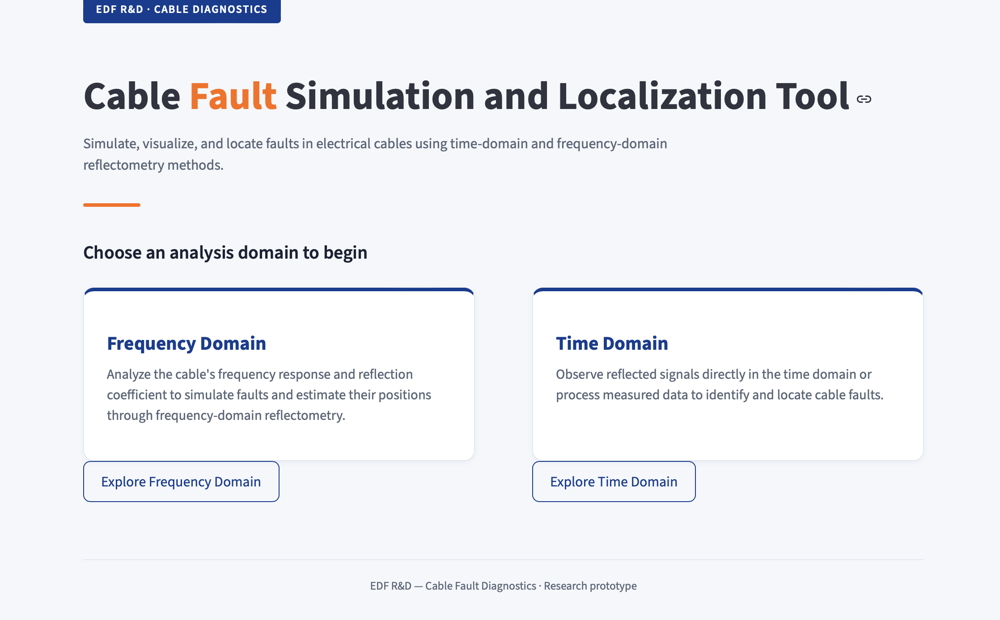
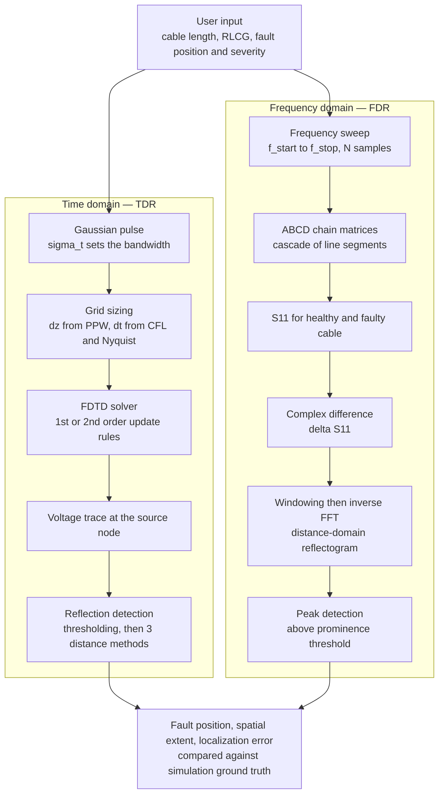
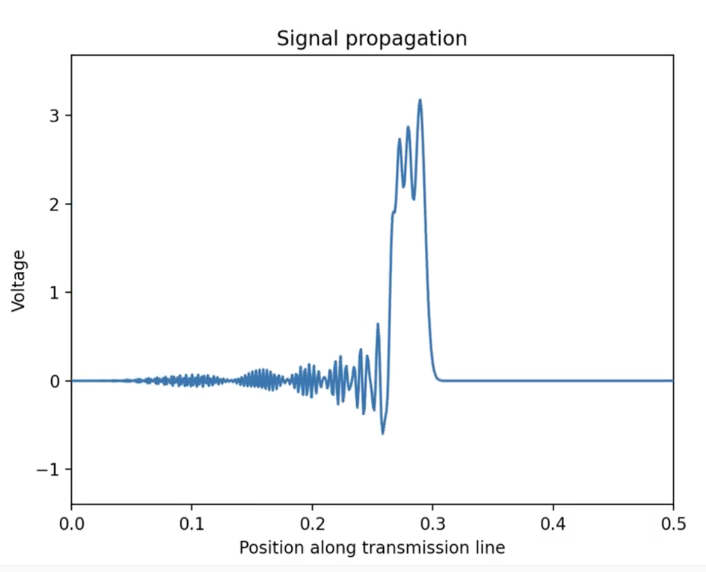
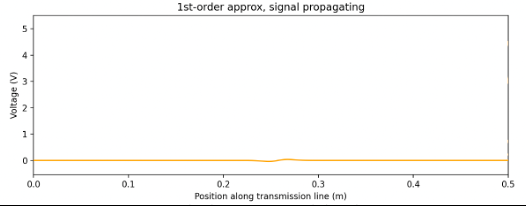
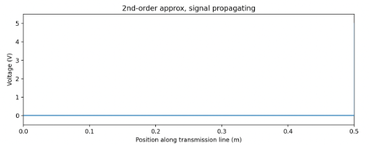
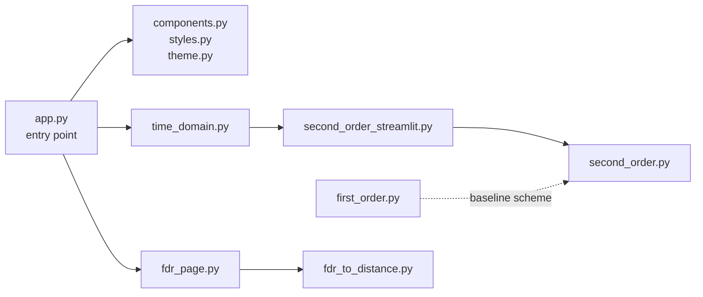
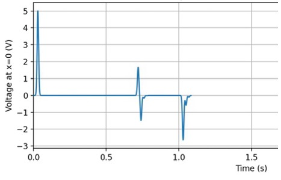
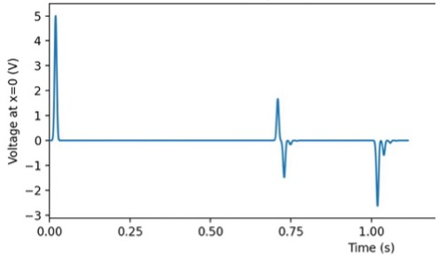

# Cable Fault Detection : an interactive reflectometry simulator

> Locate faults in electrical cables from reflected signal analysis, in both the time and frequency domains, without needing signal processing expertise.

**[Try the tool online](https://cablefault-ehi3c5lqxdnre9q4bmhjii.streamlit.app/)** — no installation required.

> Research project carried out with **EDF R&D**, Bachelor of Global Engineering, CentraleSupélec x McGill University.
> Team: Benjamin Dieu, Hanae Frotier de Bagneux, Lina Skik, Hana Toumi. Industrial supervisor: Susana Naranjo Villamil (EDF).
> My contribution: [to fill in].
> Full technical report: [`docs/cable_fault_detection_report.pdf`](docs/cable_fault_detection_report.pdf)



---

## The problem

When a fault appears in a buried cable, it can be anywhere along several kilometres of infrastructure, invisible to direct inspection. Reflectometry solves this by injecting a signal into the cable and reading the echo: an impedance discontinuity sends part of the wave back, and the round-trip delay gives its position.

The instruments that do this exist, but they cost a lot and their waveforms need a trained eye to interpret. There is no accessible way to simulate a fault, watch how the signal behaves, and compare detection methods before deploying hardware. EDF also needs large labelled datasets to train fault-diagnosis algorithms, and a simulator is a natural way to generate them.

**Research question.** To what extent can an interactive simulation tool, based on transmission line theory, reliably localize cable faults from reflected signal analysis while remaining accessible to users without signal processing expertise?

**Answer, in short:** roughly 1 % localization accuracy relative to cable length, in both domains, through a browser interface that exposes every physical parameter.

---

## Pipeline



---

## 1. Physical model

A cable is not a lumped component. Once its length becomes comparable to the signal wavelength, different points along it sit at different phases at the same instant, and a distributed model is required.

The line is cut into infinitesimal segments of length $\Delta z$, each described by four per-unit-length parameters: resistance $R$ (Ω/m), inductance $L$ (H/m), capacitance $C$ (F/m) and conductance $G$ (S/m). Applying Kirchhoff's two laws to one segment and letting $\Delta z \to 0$ gives the **telegrapher's equations**:

$$\frac{\partial v(z,t)}{\partial z} = -R(z)\,i(z,t) - L(z)\frac{\partial i(z,t)}{\partial t}$$

$$\frac{\partial i(z,t)}{\partial z} = -G(z)\,v(z,t) - C(z)\frac{\partial v(z,t)}{\partial t}$$

Everything downstream follows from these two. **A fault is a localized deviation of one or more RLCG parameters**, which shifts the local characteristic impedance and therefore produces a reflection.

In sinusoidal regime, the phasor form turns them into ordinary differential equations in $z$, whose solutions are two counter-propagating waves governed by the propagation constant and the characteristic impedance:

$$\gamma = \sqrt{(R + j\omega L)(G + j\omega C)} = \alpha + j\beta
\qquad
Z_c = \sqrt{\frac{R + j\omega L}{G + j\omega C}}$$

At any impedance discontinuity, the reflection coefficient is:

$$\Gamma = \frac{Z_L - Z_c}{Z_L + Z_c}$$

with $\Gamma = 0$ for a matched load, $+1$ for an open circuit and $-1$ for a short. This single quantity is what the whole diagnostic rests on.

---

## 2. Time domain : FDTD

### Discretization

The cable is divided into $K$ segments of length $\Delta z$, the simulation into $N$ steps of $\Delta t$. RLCG values are stored **per grid point**, which is precisely what allows a non-uniform line, and therefore a fault, to be represented without touching the solver structure.

### Stability

The steps cannot be chosen freely. Two constraints are enforced automatically rather than left to the user:

$$\text{CFL:}\quad \Delta t \leq 0.9\,\frac{\Delta z}{v_{max}}
\qquad\qquad
\text{Nyquist:}\quad \Delta t \leq \frac{1}{2f_{max}}$$

and $\Delta t = \min(\Delta t_{CFL}, \Delta t_{Nyq})$ is taken. The spatial step comes from the shortest wavelength present, divided by a points-per-wavelength accuracy knob (10 minimum to avoid numerical dispersion):

$$\Delta z = \frac{\lambda_{min}}{PPW} = \frac{v_{min}}{f_{max}\cdot PPW}$$

Violate these and the solution diverges into unphysical oscillations:



### First-order scheme

Explicit leapfrog updates on a co-located grid, current then voltage:

$$I_k^{n+1} = I_k^n\,\frac{L_k - R_k\Delta t}{L_k} - \frac{\Delta t}{L_k \Delta z}\left(U_{k+1}^n - U_k^n\right)$$

$$U_k^{n+1} = U_k^n\,\frac{C_k - G_k\Delta t}{C_k} - \frac{\Delta t}{C_k \Delta z}\left(I_{k+1}^n - I_k^n\right)$$

Source and load boundaries close the system, coupling the injected signal $U_S(t)$ and the impedances $Z_S$, $Z_L$ to the first and last nodes.

### Second-order scheme

The first-order scheme has two defects. It treats the wave as piecewise-constant within a step, which creates a **parasitic reflection even at a perfectly matched load**, and it introduces numerical dispersion, so a sharp front drags a ringing tail behind it.

The fix is to evaluate the current at half-integer time steps $(n+\frac{1}{2})$ and half-integer spatial points $(k+\frac{1}{2})$, averaging information from both directions in space and time:

$$U_k^{n+1} = U_k^n\,\frac{2C_k - G_k\Delta t}{2C_k + G_k\Delta t} - \frac{2\Delta t}{(2C_k + G_k\Delta t)\Delta z}\left(I_{k+1/2}^{n+1/2} - I_{k-1/2}^{n+1/2}\right)$$

The effect is visible directly. Same Gaussian pulse, same matched load, first order then second order:

| First order | Second order |
|---|---|
|  |  |
| A small wave comes back from a load that should reflect nothing | Nothing comes back, as physics demands |

The second-order scheme is preferred whenever reflection accuracy matters, which is the whole point here. The first-order one is kept as a readable baseline.

### Turning echoes into distances

The measured signal is the voltage at the source node. Reflections are isolated by thresholding against a fraction of the peak value and segmenting the trace into events, the first being the emitted pulse itself. Three complementary methods then convert an event into a position:

1. **Direct wave speed.** $d = v\,t_{round trip}/2$. The most direct, but assumes the fault does not change the local propagation speed.

2. **End-reflection calibration.** The echo from the far end is identified, and every other reflection is expressed as a ratio of it: $d = \ell \cdot t_{refl}/t_{end}$. This self-calibrates against the measured echo instead of trusting the nominal speed, absorbing discretization error.

3. **Entry/exit pairing.** A fault of finite length produces *two* reflections, one entering and one leaving. The entry reflection coefficient gives the local impedance, $Z_{fault} = Z_0(1+\Gamma)/(1-\Gamma)$, from which the expected exit amplitude $A_{exit} = A_{entry}(-(1-\Gamma^2))$ is predicted. Finding that match gives the **physical extent** of the fault, not just its position. Later echoes spaced at the same interval are recognized as internal reverberations and excluded, so they are not counted as extra faults.

The method is selected automatically: time-ratio when only $R$ or $G$ differ across sections, impedance pairing when $L$ or $C$ varies.

---

## 3. Frequency domain : FDR

Rather than tracking a transient, this module sweeps a sinusoidal excitation across a band and reads the steady-state response. It mirrors what a vector network analyzer measures on a real cable, which is why it maps directly onto EDF practice.

### S11 through ABCD chain matrices

The cable is partitioned into two-port elements. Each uniform segment of length $l$ has an analytic ABCD matrix:

$$M = \begin{pmatrix} \cosh(\gamma l) & Z_c \sinh(\gamma l) \\[1ex] \dfrac{\sinh(\gamma l)}{Z_c} & \cosh(\gamma l) \end{pmatrix}$$

Cascading them in propagation order gives the total matrix, hence the input impedance and the source-port reflection coefficient:

$$Z_{in}(f) = \frac{A Z_L + B}{C Z_L + D}
\qquad\qquad
S_{11}(f) = \frac{Z_{in} - Z_s}{Z_{in} + Z_s}$$

### Baseline subtraction

A real cable returns a non-zero $S_{11}$ even when healthy, because of connectors and residual mismatch. The fault contribution is isolated by computing the response twice and subtracting **in the complex domain**:

$$\Delta S_{11}(f) = S_{11}^{faulty}(f) - S_{11}^{healthy}(f)$$

Subtracting magnitudes instead would be a mistake: it is the *phase* of $S_{11}$ that encodes the round-trip delay, so a magnitude-only subtraction destroys all distance information.

A fault at depth $d_f$ contributes a term that oscillates in frequency:

$$S_{11,fault}(f) \approx \Gamma_f\,e^{-2\alpha d_f}\,e^{-j 4\pi f d_f / v_\varphi}$$

A fault at 30 m oscillates twice as fast as one at 15 m. Depth is a spectral fingerprint.

### Back to distance

An inverse Fourier transform of $\Delta S_{11}$ converts the spectrum into a distance-domain reflectogram, using $x = v_p t / 2$ for the round trip. Two limits govern what the measurement can see:

$$\text{resolution}\quad \Delta x = \frac{v_p}{2B}
\qquad\qquad
\text{unambiguous range}\quad x_{max} = \frac{v_p}{2\,\delta f}$$

Wider bandwidth means finer resolution; denser frequency sampling means longer range. A Hann or Blackman window suppresses sidelobes that could be mistaken for extra faults, at the cost of broadening each peak by a known factor. Zero-padding smooths the curve but does not improve true resolution, which stays fixed by $B$.

Both limits are computed from the sweep parameters and drawn directly on the reflectogram, so the user sees what the measurement can and cannot resolve. Detected peaks are cross-checked against the true fault positions known from the model, and closely spaced faults are flagged when they fall within the effective resolution and will merge into a single feature.

### Ground-truth impedance profile

Because the simulator knows the RLCG values everywhere, it can also plot the true impedance profile alongside the reflectogram:

$$\Delta Z_c(x)\,[\%] = 100 \cdot \frac{|Z_c(x, f_{ref})| - |Z_{c,healthy}|}{|Z_{c,healthy}|}$$

This is explicitly labelled as simulation ground truth: it would be inaccessible in a real measurement, where only $S_{11}$ is observable. Showing both side by side is what makes the tool pedagogical — you see what the fault *is*, next to what the method *detects*.

---

## 4. Implementation

### Performance

Interior updates are applied to whole arrays with vectorized NumPy rather than per-node Python loops:

```python
I[n+1, :] = A_I * I[n, :] - B_I * (V[n, 1:] - V[n, :-1])
```

Coefficient arrays are precomputed once from the per-node RLCG values and the chosen steps, not rebuilt at every iteration. Only the two boundary nodes need scalar special cases. This is what makes the simulation fast enough to run interactively in a browser.

### Code structure



| File | Role |
|---|---|
| [`app.py`](app.py) | Entry point, launches the Streamlit interface |
| [`components.py`](components.py) | Layout components of the landing page |
| [`styles.py`](styles.py) | Fonts and general look of the interface |
| [`theme.py`](theme.py) | Colour scheme |
| [`first_order.py`](first_order.py) | First-order FDTD scheme. Kept as the baseline that made the second-order derivation possible, and readable on its own |
| [`second_order.py`](second_order.py) | Second-order FDTD scheme, the one used for fault localization |
| [`second_order_streamlit.py`](second_order_streamlit.py) | Extracts from the second-order solver what the interface needs |
| [`time_domain.py`](time_domain.py) | Time-domain page: pulls results from the second-order code and displays them |
| [`fdr_page.py`](fdr_page.py) | Frequency-domain page, links the interface to the FDR code |
| [`fdr_to_distance.py`](fdr_to_distance.py) | Full frequency-domain analysis: S11, reflectogram, peak detection, plots |

### Interface

The homepage offers the two analysis modes side by side, reflecting a real methodological difference: one computes a steady-state reflection coefficient analytically, the other runs a full transient simulation.

**Time-domain module**, in three sections. Input signal (Gaussian or sinusoidal, with $f_{max}$, amplitude and PPW, and a live preview of the waveform before anything is run). Cable and fault (length, fault start and end, which RLCG parameter is modified, and by what multiplier). Simulation, which produces an animated propagation snapshot with the fault region highlighted, the TDR trace at the injection point, and a table of detected reflections with peak voltage, round-trip time, estimated distance and estimated extent.

**Frequency-domain module**, also in three. Cable configuration with $Z_s$, $Z_L$ and the healthy RLCG assumptions. Sweep configuration, with an information box recalling the resolution and range trade-off. Fault configuration, where several faults can be added dynamically to explore whether the sweep can separate them. The output is a three-panel figure — $S_{11}$ response, reflectogram with peak markers and resolution bars, ground-truth impedance profile — followed by a results table giving each fault's true region, the nearest detected peak, and the localization error in metres.

---

## 5. Results and validation

**Localization accuracy: about 1 % of the total cable length**, consistently across fault types (resistive, inductive, capacitive) and positions, in both domains.

The two methods are not interchangeable, and the comparison is one of the more useful outputs of the project. For **resistive faults**, where $L$ and $C$ are unchanged and the impedance mismatch is weak, the frequency domain is markedly easier to use: baseline subtraction isolates the fault cleanly, whereas the time domain needs careful threshold tuning to lift a small reflection out of the emitted pulse's noise floor. Conversely, the time domain gives a far more intuitive picture of what is physically happening.

### Validation against reference results

The simulator was validated on cable configurations published in an EDF internship report, doctoral theses and standard transmission-line references, reproducing their parameters and comparing reflectograms. Below, a capacitance-and-inductance fault mid-cable with a 10 Ω load, in both schemes:

| First order | Second order |
|---|---|
|  |  |

Reflection timing, amplitude and spatial extent matched the reference cases. The second validation route was direct review by the EDF industrial supervisor throughout development: propagation animations, reflectograms and localization tables were checked against practical experience with real cable diagnostics.

---

## Limitations

The FDTD solver is one-dimensional and assumes a uniform transmission line. Real cables show dielectric dispersion, connector reflections and cross-talk between conductors in a bundle, none of which are modelled.

The frequency-domain module assumes a **perfectly known healthy baseline**. In a real measurement that baseline carries noise, calibration error and slow drift, so the accuracy figures reported here are an upper bound rather than a field expectation.

Time-domain localization depends on the propagation speed being known. Here it is exact by construction, but a real cable's velocity factor is known only approximately from the datasheet and varies with temperature and ageing, which introduces a systematic distance error.

Finally, the tool models a single straight cable section with a small number of isolated faults. Real networks, EDF's in particular, are branched topologies with junctions, mixed cable types and distributed ageing.

## Perspectives

Multiple simultaneous faults in the time domain, with the overlapping reflections and pairing ambiguities that come with them. A realistic noise and calibration model in FDR, which would turn the tool into a sensitivity instrument: what is the minimum detectable fault severity for a given bandwidth and SNR. Support for uploading real oscilloscope or VNA traces, so the same localization pipeline runs on measured data instead of simulated signals.

And the one with the most leverage for EDF: using the simulator to generate large synthetic datasets — varying length, RLCG, fault type, position, severity and count, each paired with its ground-truth label — as a training basis for machine learning fault diagnosis, sidestepping the difficulty of acquiring and labelling enough real fault data.

---

## Quick start

The tool is hosted and needs no installation: **[cablefault.streamlit.app](https://cablefault-ehi3c5lqxdnre9q4bmhjii.streamlit.app/)**. The free tier is slower than a local run, but every feature works and results are identical.

To run it locally:

```bash
git clone https://github.com/hdebagneux/cable-fault-localization.git
cd cable-fault-localization
pip install -r requirements.txt
streamlit run app.py
```

## Tech stack

Python, NumPy, SciPy, Matplotlib, Streamlit.

## References

1. W. Ben Hassen, *Études de stratégies de diagnostic embarqué des réseaux filaires complexes*, doctoral thesis, INP Toulouse, 2014.
2. EDF, *Simulation and analysis of transmission line parameters using FDTD and frequency-domain methods*, internal internship report.
3. Q. Zhang, "Efficient grid operation and maintenance with simulation apps", *COMSOL Multiphysics*, pp. 24–26, Oct. 2018.
